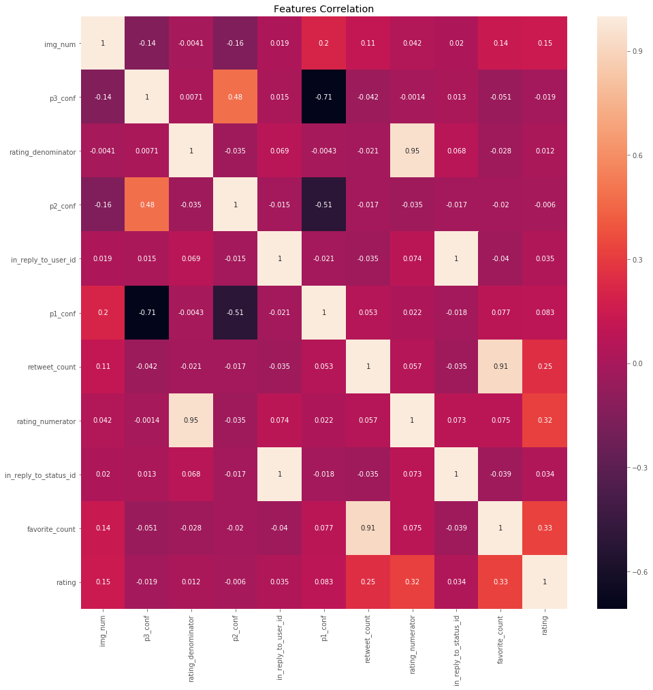
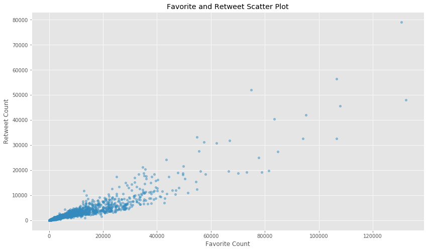
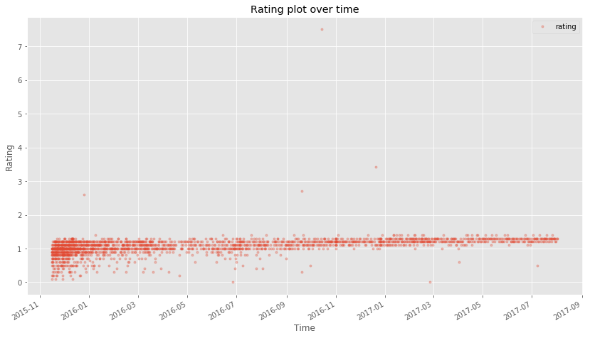
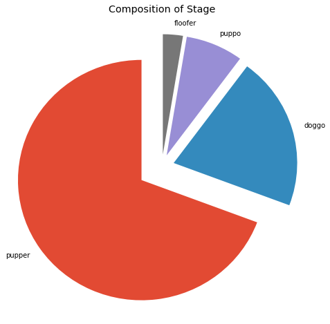
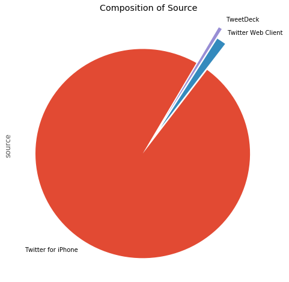
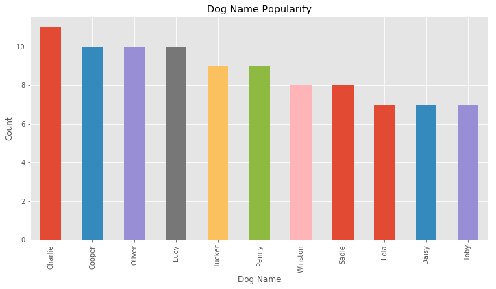
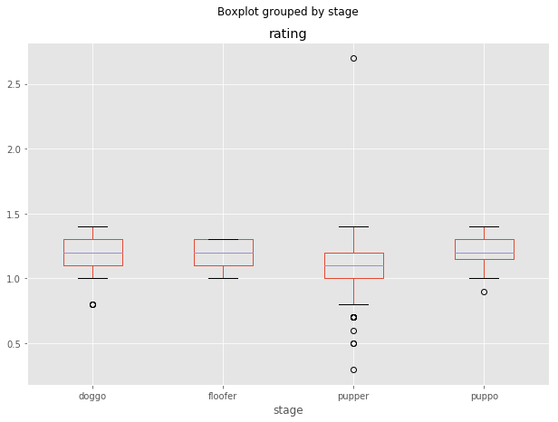
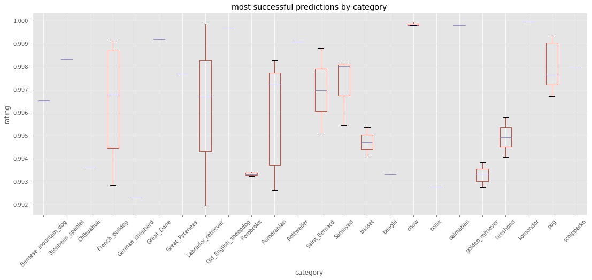
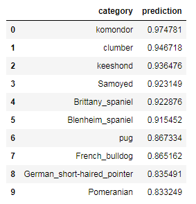

# WeRateDogs数据分析报告

Seven He

2018年9月30日

### I. 特征相关性分析

相关性分析可以看出：

- 相关性最强的是rating_numerator，评分分子越高，评分也越高这是很显然的。
- 评分跟favorite_count，retweet_count相关性很高，说明越受欢迎大众欢迎，评分越高，评分是参考了大众趋势的。
- img_num图片数量比较多时,评分也较高，资料更多也说明了重视程度更高。

### II. 推特附加数据分析

从散点图可以看出，这favorite_count和retweet_count具有很强的正相关性，点赞次数越多，则转发次数越多。

### III. 评分的时间序列分析

从时间序列分析可以看出：

- 可以看出大部分的评分在1.1左右，通常rating_numerator比rating_denominator高
- 作者的整体评分有上升趋势，尤其是低评分段，在2016年初还有很多低评分存在，从2016年下半年开始逐渐消失，推测有两种原因，一是可能twitter主更多关注热度更高的狗狗，也有可能是评分方面更加宽容。

### IV. stage比例分布

从饼图可以看出，pupper的比例最高，占了三分之二，doggo次之，floofer最少。

### V. source比例分布

从饼图可以看出，绝大多数twitter是通过手机端发布的。

### VI. 流行的狗狗名字

在WeRateDogs的twitter中，最流行的狗狗名依次是：Charlie, Cooper, Oliver, Lucy, Tucker, Penny, Winston, Sadie, Lola, Daisy, Toby。

### VII. stage评分箱线图

从箱线图可以得出，四种stage中，pupper得分相对最低，而且outlier最多，大部分也是偏低的，其他三类的分布是差不多的，puppo的下四分位数更高。

### VIII. 预测成功率最高的品种

从预测前50名的分布情况可以看出：

- komondor, chow, dalmatian, Old_English_sheepdog整体预测率最高
- 在高预测率的品种中，pug数量最多，占到8个，Pomeranian5个，chow和French_bulldog为四个

整体groupby之后的结果，预测品种排名前5分别为：komondor, clumber, keeshond, Samoyed, Brittany_spaniel